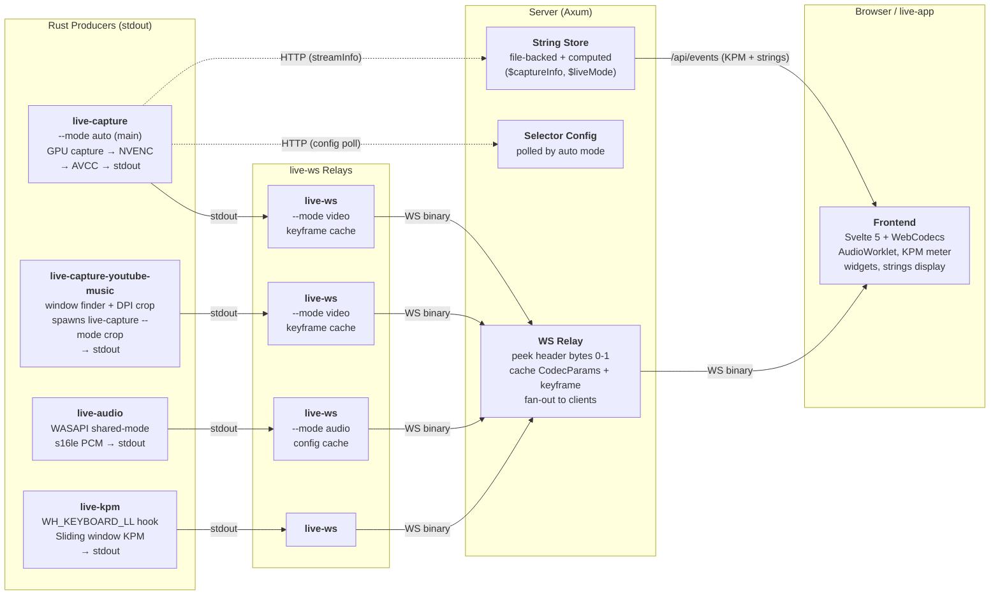

# Nekomaru LiveUI

**Nekomaru's livestreaming infrastructure.**

**Last Updated**: 2026-05-08

---

## Agent Rules

- **Always use `--release`** when invoking `cargo build` or `cargo run`. All binaries in this project are release-built by default.
- **Never hardcode `LIVE_PORT` or `LIVE_VITE_PORT`** values (e.g. `3000`, `5173`). When emitting Nushell scripts, use `$env.LIVE_PORT` and `$env.LIVE_VITE_PORT`.
- **Always write "YouTube Music" or "youtube-music"** (full words) — never abbreviate to "YTM" or "ytm" in code, comments, docs, or identifiers.

---

## Table of Contents

- **[Milestones](#milestones)**
- **[Architecture](#architecture)** — components, principles, file ownership
  - [Microservice Design](#microservice-design)
  - [Design Principles](#design-principles)
  - [Orchestration](#orchestration)
- **[Communication](#communication)** — wire protocol, HTTP/WS endpoints, CLI
  - [Wire Protocol (live-protocol)](#wire-protocol-live-protocol)
  - [HTTP & WebSocket API](#http--websocket-api)
- **[Internals](#internals)** — encoding pipeline, capture modes, deployment, reconnection
  - [Encoding Pipeline](#encoding-pipeline-reference)
  - [Capture Modes](#capture-modes)
  - [Distributed Deployment](#distributed-deployment)
  - [Reconnection Strategy](#reconnection-strategy)
  - [Color-Key Compositing](#color-key-compositing)
  - [Widgets](#widgets)
- [Performance Metrics](#performance-metrics)
- [File Structure](#file-structure)
- [Lessons Learned](#lessons-learned)
- [Known Issues](#known-issues)

---

## Milestones

This project is not semantically versioned. Instead, we track **milestones** (Mx) — architectural evolution points.

| Milestone | Architecture | Key Characteristics |
|-----------|-------------|---------------------|
| **M0** | Prototype | Auto-selector only — first proof of concept |
| **M1** | Monolith | Single Rust/wry process: capture + encoding + HTTP + webview |
| **M2** | Client-Server (TS) | TS server (Hono/Bun) + Rust capture children + React frontend + Rust webview host |
| **M3** | Client-Server (Rust) | Full RIIR — Rust server (Axum) replaces TS server |
| **M4** | Microservice | Stdout-first Rust capture workers → `live-ws` relay → Rust server (Axum). **Current architecture.** |

**This document describes M4.** For the design journey from M3 to M4, see [`M4-DESIGN.md`](M4-DESIGN.md).

---

## Architecture

### Microservice Design

M4 splits the system into independently runnable components connected via stdout pipes and WebSocket.  Producers (`live-capture`, `live-audio`, `live-kpm`) write binary frames to stdout using the `live-protocol` framing format.  `live-ws` reads stdin and relays each message as a WS binary message to the server.  The server is a thin Rust relay — no process management, no circular buffering.



### Component Summary

| Component | Language | Role | I/O |
|-----------|----------|------|-----|
| **`live-protocol`** | Rust (lib) | Shared 8-byte frame header + AVCC helpers + audio payloads | Used by all Rust crates |
| **`live-capture`** | Rust | GPU capture + NVENC encode | stdout (live-protocol framed) |
| **`live-capture-youtube-music`** | Rust | YouTube Music window finder + DPI-aware crop + auto-restart wrapper around `live-capture` | stdout (live-protocol framed) |
| **`live-audio`** | Rust | WASAPI audio capture → s16le PCM | stdout (live-protocol framed) |
| **`live-ws`** | Rust | stdin → WS relay (modes: default, video, audio) | stdin → WS binary messages |
| **`live-kpm`** | Rust | Keystroke counter | stdout (live-protocol framed) |
| **`enumerate-windows`** | Rust | Window discovery (JSON) | stdout JSON |
| **Server** | Rust (Axum) | WS relay, string store, config | WS ↔ WS, HTTP |
| **Frontend** | Svelte 5 + Vite | Viewer UI | WS (video, audio, events) |
| **`live-app`** | Rust (wry) | Optional webview host | — |

### Why This Design?

| Concern | Decision | Rationale |
|---------|----------|-----------|
| GPU capture + encoding | Rust (`live-capture`) | Requires `unsafe` Windows APIs, hardware access, zero-copy GPU pipelines. |
| Network transport | `live-ws` (separate binary) | Producers have one code path (stdout). No WS client, no reconnect logic in capture code. `live-ws` handles all networking. |
| Audio capture | Rust (`live-audio`, standalone) | WASAPI shared-mode loopback, MMCSS priority, s16le PCM.  Stdout-first — piped through `live-ws --mode audio`. |
| Keystroke counting | Rust (`live-kpm`, standalone) | `WH_KEYBOARD_LL` hook on a dedicated message pump thread. Privacy-by-design. |
| HTTP/WS server | Rust (Axum) | Thin relay — uses `live-protocol` directly, no process management. Single toolchain. |
| Window discovery | Rust (`enumerate-windows`) | Lightweight binary for Nushell scripts. JSON output. |
| YouTube Music capture | Rust (`live-capture-youtube-music`) | DPI-independent crop calculation from CSS constants, auto-restart on window loss. Stdout-first — piped through `live-ws` like any other producer. |
| Orchestration | Nushell (`mod.nu`) | Launches pipelines, manages service lifecycle. |
| Frontend | Svelte 5 + WebCodecs | Pure viewer. Receives `live-protocol` framed messages via WS. Zero H.264 knowledge. |

### Why Rust for the Server?

The initial M4 design chose a TypeScript server (Bun/Hono) because the three M3 RIIR rationales no longer applied in a microservice architecture (see [`M4-DESIGN.md` § Why TypeScript Again](M4-DESIGN.md#why-typescript-again)).  During implementation, the balance tipped back to Rust.

**What changed:** the "opaque relay" assumption broke down.  The server's `/init` endpoint must parse CodecParams and build `avc1.*` codec strings + avcC descriptors — the same logic in `live-protocol/src/avcc.rs`.  In TypeScript this meant maintaining `codec.ts` as a hand-written mirror (~100 lines) that had to stay in sync.  In Rust, the server calls `live-protocol` directly — zero duplication.

| TS Benefit (from M4 design) | Reassessment |
|---|---|
| Faster iteration (HMR) | Full server restart preferred — HMR can leave stale state.  Compile time is not an issue since every `just` recipe runs `cargo build --release` anyway. |
| Native Vite integration | `vite_proxy.rs` from M3 already solves this — a Rust reverse proxy to the Vite dev server. |
| No binary parsing | Not true — `codec.ts` duplicated `live-protocol` for the `/init` endpoint. |
| WS ergonomics | Overstated — Axum's `WebSocketUpgrade` extractor + `tokio::sync::broadcast` handles the relay fan-out pattern cleanly. |
| Portfolio (full-stack TS) | Frontend is still React/TypeScript/Bun, so the project remains hybrid. |

**The decisive gain:** single toolchain.  `cargo build --release` builds every binary in the project.  No Bun, no `node_modules`, no second package manager for the server.

### Well-Known Stream IDs

The system uses **fixed, well-known stream IDs** rather than dynamically generated ones.  Each pipeline is assigned its ID at launch (via `--stream-id` on `live-ws`), and the frontend hardcodes the same IDs.

| Stream ID | Producer | Purpose |
|-----------|----------|---------|
| `"main"` | `live-capture --mode auto` | Foreground window (auto-selector) |
| `"youtube-music"` | `live-capture --mode crop` | YouTube Music playback bar |

**Why fixed IDs?**  The frontend is a pure viewer — it has zero stream management logic.  It renders `"main"` unconditionally and shows `"youtube-music"` when available (polled via `GET /api/streams`).  No discovery protocol, no negotiation, no dynamic allocation.  When the auto-selector hot-swaps the captured window, the stream ID stays `"main"` — the server sends fresh CodecParams and a keyframe, and the frontend reinitializes its decoder.

**Where IDs are assigned:**  Nushell orchestration (`mod.nu`) passes `--stream-id` to `live-ws`, which connects to `/internal/streams/:id`.  The server creates the stream slot on first encoder connection.

### Design Principles

These principles guide M4 development and operation.

1. **No Internal Start/Stop State.**  If a process is running, it's active.  Kill it to stop it.  No state machines, no `Starting → Running → Stopped` transitions.

2. **Stateless Executables.**  Each component gets all configuration from CLI args and HTTP.  No stdin commands, no dynamic reconfiguration.  Exception: `--mode auto` polls config from the server (read-only HTTP).

3. **Stdout-First Producers.**  `live-capture`, `live-audio`, and `live-kpm` write to stdout via `live-protocol` framing.  Zero networking dependencies.  `> dump.bin` IS the production code path.

4. **Independently Runnable.**  Every component can run standalone.  No component assumes it was spawned by another.  Server runs with or without any workers connected.

5. **Pipes + WS Everywhere.**  Producers → stdout → `live-ws` → WS → server → WS → frontend.  Distributed deployment is a consequence, not a feature — just change the server URL.

6. **Server is a Relay, Not a Manager.**  The server doesn't spawn processes or manage lifecycles.  It receives connections and relays data.

7. **Errors Go to stderr.**  Each process logs to stderr via `pretty_env_logger`.  No error protocol between components.

8. **Fixed Resolutions.**  Each stream has a fixed output resolution.  The encoder never needs reconfiguration on window switch — the staging texture, NV12 converter, and MFT media types all stay the same.

### File Ownership

Each source file has a primary owner — **agent** (Claude) or **human** (Nekomaru). See [`FILE-OWNERSHIP.md`](../FILE-OWNERSHIP.md) for the full per-file breakdown.

### Orchestration

The system is launched via **`just`** recipes (`.justfile`) backed by **Nushell** commands (`mod.nu`).  `just` is the user-facing entry point; `mod.nu` contains the implementation.

#### Just Recipes

| Recipe | Description |
|--------|-------------|
| `just install` | Build all Rust binaries (`cargo build -r`) + install frontend deps (`bun i`) |
| `just server` | Start the Axum server (requires `LIVE_PORT`, `LIVE_VITE_PORT`) |
| `just capture auto` | Start the auto-selector capture pipeline |
| `just capture youtube-music` | Start the YouTube Music crop capture pipeline |
| `just kpm` | Start the keystroke counter pipeline |
| `just audio` | Start the audio capture pipeline |
| `just app` | Launch the webview host |
| `just youtube-music` | Launch YouTube Music in a webview |
| `just http <method> <path>` | HTTP request helper (e.g. `just http get /api/strings`) |
| `just push [bookmark] [revision]` | Move a jj bookmark and push to GitHub |
| `just pull [bookmark]` | Fetch from GitHub and create a new working copy |

#### `mod.nu` Exported Commands

| Command | Description |
|---------|-------------|
| `get-exe <name> [--copy <id>]` | Build a binary and return its path. `--copy` creates a named copy for concurrent use. |
| `get-url [path] [--ws]` | Build an HTTP or WS URL from `LIVE_HOST`/`LIVE_PORT` |
| `check-env <var>` | Error if an environment variable is not set |
| `patch-env <var> <default>` | Prompt to set an environment variable if missing |
| `run-server` | Launch `live-server` (builds first via `get-exe`) |
| `run-app` | Launch `live-app` webview (builds + copies via `get-exe`) |
| `run-youtube-music` | Launch YouTube Music webview (builds + copies via `get-exe`) |
| `run-capture auto` | Launch the auto-selector pipeline (`live-capture \| live-ws`) |
| `run-capture youtube-music` | Launch `live-capture-youtube-music \| live-ws` pipeline |
| `run-audio [device]` | Launch the audio pipeline (`live-audio \| live-ws --mode audio`) |
| `run-kpm` | Launch the KPM pipeline (`live-kpm \| live-ws`) |
| `run-ccusage [--loop]` | Run `ccusage` once (default) or every 60s (`--loop`) and post today's Claude Code token + cost totals to the string store |

#### Build Freshness & Copy Rule

Every binary invocation goes through `get-exe`, which runs `cargo build --release --bin <name>` to ensure the binary is up-to-date.  Binaries that may run concurrently across launchers (`live-capture`, `live-ws`, `live-app`) use `get-exe --copy <id>` to copy the exe before spawning — this prevents file locking from blocking subsequent builds on Windows.

---

## Communication

### Wire Protocol (live-protocol)

All binary IPC uses the `live-protocol` 8-byte aligned frame header.  Used on stdout (producer → live-ws), on WebSocket (live-ws → server → frontend), and in dump files.

#### Frame Header (8 bytes)

```
Offset  Field            Size    Notes
0       message_type     u8      0x01=CodecParams, 0x02=Frame, 0x10=KpmUpdate, 0x11=AudioConfig, 0x12=AudioChunk, 0xFF=Error
1       flags            u8      bit 0: IS_KEYFRAME (video), bits 1-7: reserved
2       reserved         u16     zero
4       payload_length   u32 LE
[payload_length bytes follow]
```

#### Message Types

##### `0x01` — CodecParams

Sent once after encoder initialization, and again if SPS/PPS change (e.g. on hot-swap).

```
[u16 LE: width][u16 LE: height]
[u16 LE: sps_length][sps bytes]
[u16 LE: pps_length][pps bytes]
```

##### `0x02` — Frame

Sent for every encoded frame. `is_keyframe` is in the header `flags` field, not in the payload.

```
[u64 LE: timestamp_us][avcc bytes]
```

The AVCC payload is pre-built by `live-capture` — concatenated length-prefixed NAL units (4-byte BE length + raw NAL data, no Annex B start codes). Directly feedable to `EncodedVideoChunk`.

##### `0x10` — KpmUpdate

Sent by `live-kpm` on value change.

```
[i64 LE: kpm_value]
```

##### `0x11` — AudioConfig

Sent once by `live-audio` after WASAPI device initialization.

```
[u32 LE: sample_rate][u8: channels][u8: bits_per_sample][u16: reserved=0]
```

##### `0x12` — AudioChunk

Sent by `live-audio` every 10ms (480 samples at 48kHz).

```
[u64 LE: timestamp_us][interleaved s16le PCM bytes]
```

##### `0xFF` — Error

Non-fatal error. Fatal errors are signaled by process exit.

```
[UTF-8 error message bytes]
```

### live-audio CLI

```bash
# List available audio capture devices
live-audio --list-devices

# Capture from a named device to stdout
live-audio --device "Loopback L + R (Focusrite USB Audio)"

# Full pipeline — capture + relay to server
live-audio --device "..." | live-ws --mode audio --server ws://host:3000/internal/audio

# Dump to file (same binary format as production)
live-audio --device "..." > dump.bin
```

### live-capture CLI

```bash
# Base mode — capture + encode to stdout
live-capture --hwnd 0x1A2B --width 1920 --height 1200

# Auto mode — foreground polling + hot-swap
live-capture --mode auto --width 1920 --height 1200 \
  --config-url http://host/api/selector/config \
  --info-url http://host/internal/streams/main/info

# Crop mode — fixed subrect extraction
live-capture --mode crop --hwnd 0x1A2B \
  --crop-min-x 0 --crop-min-y 600 --crop-max-x 1920 --crop-max-y 700 --fps 15

# Dump to file (production code path — same output format)
live-capture --hwnd 0x1A2B --width 1920 --height 1200 > dump.bin
```

### enumerate-windows CLI

```bash
# List all capturable windows as JSON
enumerate-windows

# Get the current foreground window as JSON
enumerate-windows --foreground
```

---

### HTTP & WebSocket API

Served by the Rust server (Axum). Port configured via `LIVE_PORT` (required).

Endpoints are split into two namespaces:
- **`/api/`** — public, frontend-facing
- **`/internal/`** — worker-facing (encoder input, capture events)

#### Public API (`/api`)

##### Streams

**`GET /api/streams`** — List active streams (derived from connected encoder WS sockets).

```json
[{ "id": "main" }, { "id": "youtube-music" }]
```

**`GET /api/streams/:id/init`** — Pre-built decoder configuration. The server parses cached CodecParams via `live-protocol` to build the `avc1.PPCCLL` codec string and avcC descriptor.

```json
{
    "codec": "avc1.42001f",
    "width": 1920,
    "height": 1200,
    "description": "<base64 of avcC descriptor>"
}
```

**`WS /api/streams/:id`** — Frontend viewer. Pushes relayed binary messages. On connect, sends cached CodecParams + last keyframe for immediate playback.

##### Audio

**`WS /api/audio`** — Frontend audio stream. Pushes binary `live-protocol` messages (`AudioConfig` + `AudioChunk`). On connect, sends cached `AudioConfig` for immediate AudioWorklet setup.

##### Events (unified frontend telemetry)

**`WS /api/events`** — Single push channel for lightweight viewer telemetry. Replaces the per-source `/api/kpm` and `/api/strings/ws` endpoints (both still registered during migration, but no longer used by the frontend).

Tagged JSON text frames — currently two `type` values:

```jsonc
{ "type": "kpm",     "kpm": 142 }                              // null when encoder is offline
{ "type": "strings", "data": { "$captureInfo": "...", ... } }  // full merged snapshot
```

On connect: replays the current KPM value, then the full strings snapshot (in that order, atomically).  Subsequent updates fire a single tagged message per change.  Implemented via `tokio::select!` over the KPM and strings `watch::Receiver`s so both sources share one fan-in loop.

Why one endpoint: the frontend used to open four reconnect-loops in parallel (video, audio, kpm, strings) with duplicated backoff logic; KPM and strings are the small JSON-text streams where the connection-count cost dominated.  Heavy media (video, audio) stays on dedicated endpoints — they have their own keyframe / config caches, lifecycles, and backpressure policies, and folding them in would invite head-of-line blocking.

##### KPM (legacy)

**`WS /api/kpm`** — Frontend KPM display. Pushes `{"kpm": N}` or `{"kpm": null}` JSON text. Initial value sent on connect.  *Superseded by `/api/events`; kept registered while the migration settles, slated for removal in a follow-up commit.*

##### String Store

Server-managed key-value store. Keys prefixed with `$` are **computed strings** — readonly values set by worker info reports.

**Current computed strings:**

| Key | Source | Description |
|-----|--------|-------------|
| `$captureInfo` | `POST /internal/streams/:id/info` | Human-readable label for the captured window |
| `$captureMode` | `POST /internal/streams/:id/info` | Current capture mode (e.g. `"auto"`) |
| `$liveMode` | `POST /internal/streams/:id/info` | Mode tag from matched pattern (e.g. `"code"`, `"game"`) |
| `$microphone` | Audio encoder connect/disconnect | Audio stream status (present when `live-audio` encoder is connected, absent otherwise) |
| `$timestamp` | Server startup | Revision timestamp via `jj log` |
| `$claudeTokens` | `run-ccusage` poller | Today's total Claude Code token count (raw integer; frontend formats to millions) |
| `$claudeCost` | `run-ccusage` poller | Today's estimated Claude Code cost in USD (raw float) |

**`GET /api/strings`** — All key-value pairs (file-backed + computed).  Kept for ad-hoc inspection (curl, Nushell scripts); the frontend now consumes string snapshots via `/api/events`.

**`GET /api/strings/:key`** — Single string value.

**`WS /api/strings/ws`** — Snapshot stream.  Sends the merged `get_all()` JSON object on connect and again after every mutation.  Multiple writes between polls coalesce via a `tokio::sync::watch` channel — viewers only ever see the latest state.  *Superseded by `/api/events` (which embeds the same snapshots under `{"type":"strings",...}`); kept registered during migration, slated for removal in a follow-up commit.*

**`PUT /api/strings/:key`** — Set a string value (plain text body). Returns 403 for `$`-prefixed keys.

**`DELETE /api/strings/:key`** — Delete a string. Returns 403 for `$`-prefixed keys.

##### Selector Config

The server stores the selector config; `live-capture --mode auto` polls it.

**`GET /api/selector/config`** — Full preset config (polled by auto mode every ~20s).

**`PUT /api/selector/config`** — Replace full config.

**`PUT /api/selector/preset`** — Switch active preset by name (text/plain body).

##### Refresh

**`POST /api/refresh`** — Reload selector config and string store from disk.

#### Internal API (`/internal`)

##### Encoder Input

**`WS /internal/streams/:id`** — Encoder input. Receives `live-protocol` binary messages from `live-ws`. The server peeks at header bytes 0-1 to cache CodecParams and keyframes, then fan-outs to all connected frontend clients.

**`WS /internal/audio`** — Audio input from `live-audio` via `live-ws --mode audio`. Binary `live-protocol` messages (`AudioConfig` + `AudioChunk`). The server caches `AudioConfig` for late-joining viewers, then broadcasts all messages.

**`WS /internal/kpm`** — KPM input from `live-kpm` via `live-ws`. Binary `live-protocol` messages.

##### Computed Strings

**`PUT /internal/strings/:key`** — Set a computed string (`$`-prefixed) from an external process (plain text body).  Returns 400 if the key doesn't start with `$`.

**`DELETE /internal/strings/:key`** — Remove a computed string (`$`-prefixed).  Returns 400 if the key doesn't start with `$`.  Used by `run-microphone` to signal absence (e.g. Cubase not running).

##### Stream Info

**`POST /internal/streams/:streamId/info`** — Periodic capture metadata from `live-capture --mode auto` (every ~2s). Updates computed strings.  On window swaps, the selector queues a swap-tagged POST *before* dispatching the swap to the capture pipeline; a dedicated poster worker in `live-capture` handles the actual HTTP request so a slow or unreachable server never freezes the polling loop — see [Strings-Gated Keys](#strings-gated-keys-main-stream).

```json
{
    "hwnd": "0x1A2B",
    "title": "Visual Studio Code",
    "file_description": "Visual Studio Code",
    "mode": "code"
}
```

---

## Internals

### Encoding Pipeline Reference

#### Format Converter (`live-capture/src/converter.rs`)

GPU-accelerated BGRA→NV12 conversion via `ID3D11VideoProcessor`. Hardware H.264 encoders require NV12 input. Performance: ~0.5-1ms for 1920x1200.

#### H.264 Encoder (`live-capture/src/encoder.rs`)

Async Media Foundation Transform (MFT). Runs a blocking event loop:

- `METransformNeedInput` → read from staging texture, convert, feed to encoder
- `METransformHaveOutput` → parse NAL units, convert to AVCC, write to stdout

NAL unit types: SPS(7) ~27B, PPS(8) ~8B, IDR(5) ~67KB, NonIDR(1) ~1.5-30KB.

#### "Bakery Model" (Capture Thread ↔ Encoding Thread)

Within `live-capture`, the capture thread (main) and encoding thread share a staging texture ("the shelf"). The capture thread continuously restocks it with the latest captured frame; the encoding thread reads at a constant 60fps. No channels, no CPU copies — just a shared GPU texture with `Flush()` synchronization.

In **auto mode**, the capture session can be hot-swapped without restarting the encoder. The staging texture dimensions are fixed (set at startup), so the encoder's input format never changes. On window switch, only the `CaptureSession` is replaced.


### Capture Modes

`live-capture` supports three modes via `--mode`:

- **`base`** (default): captures a specific window by HWND, resamples to `--width x --height`.
- **`auto`**: foreground polling + pattern matching + hot-swap capture session. The encoder never restarts — only the `CaptureSession` is replaced on window switch.
- **`crop`**: extracts an absolute subrect via `--crop-min-x/y --crop-max-x/y`. Used for YouTube Music playback bar.  Typically launched by `live-capture-youtube-music` which computes the crop rect from CSS layout constants and actual DPI.

All modes output to stdout via `live-protocol` framing. Pipe through `live-ws` for network delivery.

### Selector Pattern Format

The auto-selector matches foreground windows against patterns from the server config. Format: `[@mode] <exePath>[@<windowTitle>]`.

- `@code devenv.exe` — match devenv, set mode="code"
- `@game D:/7-Games/` — match any exe under path, set mode="game"
- `@exclude gogh.exe` — veto rule (checked first, case-insensitive)
- `Code.exe@LiveUI` — match Code.exe with "liveui" in title (AND)

### Distributed Deployment

M4's microservice design enables splitting components across machines.  Each producer is a stdout-first executable piped through `live-ws` — just point `live-ws` at a remote server URL.

```
Machine A (streaming):  server + live-capture-youtube-music + YouTube Music + OBS + live-app
Machine B (working):    live-capture --mode auto (main) + live-kpm
```

- YouTube Music audio: OBS captures system audio directly on Machine A.  Zero network audio transfer.
- Only the main video stream crosses the LAN (~1.8 MB/s at 60fps, trivial on gigabit).
- Machine B runs only what needs direct window/GPU access.
- Face capture (OBS camera) stays on Machine A — no CPU competition with `rustc`.

### Reconnection Strategy

`live-ws` owns all reconnection logic — producers don't know about WS state.

- The encoder writes to stdout continuously.  If `live-ws` disconnects, it discards incoming messages.
- On reconnect, `live-ws --mode video` replays the cached last CodecParams + last keyframe so the server immediately has valid codec state and a clean entry point.  `--mode audio` similarly replays the cached `AudioConfig`.
- Exponential backoff (100ms → 5s) prevents reconnection storms.
- The encoder never restarts — avoiding the NVENC teardown that M4 was designed to eliminate.

#### Frontend reconnect helper

The viewer side mirrors the same backoff curve through a single helper, `runReconnectingWS(path, signal, body)` in [`frontend/src/ws.ts`](../frontend/src/ws.ts).  It owns URL construction, abort wiring, and the 100ms→5s exponential reset-on-open loop; per-stream bodies own message parsing and decide when the connection ends (typically by resolving on `onclose`).  All three viewer-side WSes (`/api/streams/:id`, `/api/audio`, `/api/events`) flow through it — no duplicated backoff loops across streams.

### Codec & Keyframe Caching

H.264 decoders need two things before they can produce frames: **CodecParams** (SPS/PPS — the encoder's configuration) to initialize, and a **keyframe** (IDR) as a decode entry point.  Without caching, anything that missed these must wait up to 2 seconds (one full GOP of 120 frames at 60fps) for the next naturally-occurring IDR.

Two independent caches at different points in the pipeline eliminate this wait:

**`live-ws` cache — reconnect replay.**  The encoder never restarts (core M4 principle — avoiding NVENC teardown).  When the WS connection drops, `live-ws` reconnects and replays the cached CodecParams + keyframe *before* resuming normal forwarding.  The server instantly has valid codec state and a clean decode entry point.  This cache lives outside the server process, so it also survives server restarts — `live-ws` reconnects and replays, warming the server immediately.

**Server cache — late-joiner init.**  The server fans out to multiple frontend clients.  A browser tab can open at any time — mid-stream, after a refresh, on a second monitor.  On viewer connect, the server sends cached CodecParams + keyframe for immediate playback.  The same CodecParams cache also powers the `GET /api/v1/streams/:id/init` endpoint, which parses the SPS/PPS to build the `avc1.PPCCLL` codec string and avcC descriptor for `VideoDecoder.configure()`.

| Scenario | `live-ws` cache | Server cache |
|----------|:---:|:---:|
| WS drops, `live-ws` reconnects | Replays to server | — |
| Server restarts | Replays to server | Rebuilt from replay |
| New browser tab connects | — | Sends to viewer |
| Hot-swap (new SPS/PPS) | Updates cache | Updates cache |

Neither cache is redundant.  Removing the `live-ws` cache means the server loses codec state on reconnect.  Removing the server cache means every new viewer waits for the next keyframe.

### Color-Key Compositing

The frontend uses a WebGL2 fragment shader (`frontend/src/video/color-key.ts`) to replace one or more target colors with transparency in incoming video frames.  Used by the YouTube Music island (`#212121` background) and the main stream (the dark UI greys), so the page backdrop bleeds through wherever the captured app shows its own background.

**Algorithm (per pixel, in linear-light space):**

1. Convert the source pixel sRGB → linear.
2. For each key, compute a per-channel "foreground signal vs. background" ratio (`(src − key) / (1 − key)`, clamped at zero) and take the max-channel.  The lowest result across keys is the alpha estimate; the same loop tracks which key matched best (for unspill).
3. Shape with `smoothstep(kneeLow, kneeHigh, alpha)` — defaults `[0.02, 0.98]`.  `kneeLow` is the noise floor (compression jitter near the background snaps to 0); `kneeHigh` snaps near-solid foreground to 1; the middle preserves anti-aliased edges.
4. Unspill against the best-matching key (`src − key · (1 − alpha)`), divide out alpha to recover straight RGB, re-encode linear → sRGB.

Working in linear space is what kills dark fringing — without it, the gamma curve makes near-key pixels look halo'd against dark UI backgrounds.

The `<StreamRenderer>` component accepts `colorKey?: string | string[]` (up to 8 hex colors) and `colorKeyKnee?: [number, number]`.  Both fall back to defaults when omitted; omitting `colorKey` entirely bypasses the shader and uses a plain 2D canvas blit.

#### Strings-Gated Keys (Main Stream)

For the main stream, the active key set is selected dynamically in `App.svelte` from the `$captureInfo` / `$liveMode` strings posted by the auto-selector — so the keys track the captured app (e.g. VS Code's dark UI greys for the `code` mode).  To keep this in sync with the video, the selector queues a swap-tagged stream-info POST *before* dispatching the swap command to the capture loop.  A small `selector-poster` worker thread (one per `live-capture` process) drains the queue over a keep-alive `ureq::Agent` and coalesces stale heartbeats; the selector itself never blocks on HTTP, so a slow or unreachable server can't pause window matching.  Strict synchronous ordering relaxes to best-effort by latency margin — localhost POST + WS broadcast (~5–15 ms) almost always lands at the frontend ahead of the first new-window frame clearing the capture + NVENC + WS pipeline (~20–60 ms).  Documented at the top of `live-capture/src/selector/mod.rs`.

### Widgets

The left column of the UI hosts **widgets** — small status indicators built from a shared `LiveWidget` component (`frontend/src/widgets/common.tsx`).

#### Layout

Each widget has a consistent three-part structure:

```
┌─────────────────────┐
│  [icon]  Label      │   ← icon (optional) + muted label (text-xs, 60% opacity)
│          Content    │   ← prominent value (text-base, full opacity)
└─────────────────────┘
```

#### Dynamic Content

`LiveWidget` is purely presentational. For dynamic values, the parent component reads from the `strings` rune singleton (`frontend/src/events.svelte.ts`) — a WS-backed snapshot of the server's string store, fed by `/api/events` — and passes values as `children`.  The same module also exposes the `kpm` rune consumed by `KpmMeter.svelte`.

#### Placement

Widgets are rendered inside the left-column island in `App.svelte` using `flex-col gap-3` layout.

---

## Performance Metrics

### Latency Breakdown (Estimated)

| Component | Time | Method |
|-----------|------|--------|
| Capture | 0-16ms | Windows Graphics Capture (1 frame buffer) |
| Resample | 0.5-1ms | GPU shader (fullscreen triangle) |
| GPU Flush + Wait | 5ms | `Flush()` + `sleep(5ms)` |
| BGRA→NV12 | 0.5-1ms | `ID3D11VideoProcessor` |
| GPU Flush | 1-2ms | `Flush()` |
| H.264 Encode | 5-15ms | NVENC hardware encoder |
| AVCC Serialize | <0.1ms | CPU: strip start codes + length prefix |
| IPC (stdout → live-ws) | <0.1ms | Pipe buffer, same machine |
| WS relay (server) | <1ms | Localhost or LAN |
| **Total** | **13-36ms** | Well under 100ms target |

### Frame Sizes (1920x1200 @ 8 Mbps CBR)

| Frame Type | Size Range | Scenario |
|------------|------------|----------|
| **IDR (keyframe)** | ~67 KB | SPS(27B) + PPS(8B) + full I-frame |
| **P-frame (static)** | 1.5-10 KB | Mostly unchanged screen content |
| **P-frame (typing/scrolling)** | 10-30 KB | Text editing, web browsing |
| **P-frame (high motion)** | 30-50 KB | Video playback, animations |

### Encoding Settings

| Setting | Value | Reason |
|---------|-------|--------|
| Profile | H.264 Baseline | No B-frames, WebCodecs compatibility |
| Bitrate | 8 Mbps CBR | Constant for predictable latency |
| Frame Rate | 60 fps | Encoder runs at constant 60fps |
| GOP Size | 120 frames (2 sec) | Fast recovery from packet loss |
| B-frames | 0 | Baseline profile prohibits (low latency) |
| Low Latency Mode | Enabled | `CODECAPI_AVLowLatencyMode = true` |

---

## File Structure

```
LiveUI/
├── Cargo.toml                       # Workspace root
├── .justfile                        # Task runner recipes (just)
├── mod.nu                           # Nushell orchestration module
│
├── docs/
│   ├── README.md                    # This document
│   └── M4-DESIGN.md                # M4 architecture design & journey
│
├── data/                            # Persisted runtime data (gitignored)
│   ├── strings.json                 # String store key-value pairs
│   ├── strings/                     # Per-key Markdown files for multiline values
│   └── selector-config.json         # Auto-selector preset config
│
├── live-protocol/                   # Shared binary framing protocol (Rust lib)
│   └── src/
│       ├── lib.rs                   # 8-byte frame header, MessageType, Flags, read/write
│       ├── audio.rs                 # AudioConfig + AudioChunk payload serialization
│       ├── avcc.rs                  # Annex B → AVCC conversion, codec string, avcC builder
│       └── video.rs                 # CodecParams + Frame payload serialization
│
├── live-capture/                    # GPU capture + H.264 encode → stdout (Rust)
│   └── src/
│       ├── lib.rs                   # NALUnit/NALUnitType types, module re-exports
│       ├── main.rs                  # CLI: --mode base|auto|crop, capture loop, encoding thread
│       ├── capture.rs               # WinRT CaptureSession, CropBox, viewport calculation
│       ├── converter.rs             # GPU BGRA→NV12 via ID3D11VideoProcessor
│       ├── d3d11.rs                 # D3D11 device, texture, RTV/SRV helpers
│       ├── encoder.rs               # NVENC H.264 async MFT
│       ├── encoder/                 # NVENC helpers (debug, finder)
│       ├── resample.rs + .hlsl      # GPU fullscreen quad resampler
│       └── selector/                # Auto-selector (foreground polling, pattern matching)
│           ├── mod.rs               # Selector thread + non-blocking poster worker (keep-alive POSTs, swap-aware coalescing)
│           └── config.rs            # PresetConfig, ParsedPattern, should_capture()
│
├── live-capture-youtube-music/       # YouTube Music player bar capture wrapper (Rust)
│   └── src/
│       ├── main.rs                  # CLI, retry loop, child process spawning
│       └── crop.rs                  # DPI-aware crop: CSS layout → empirical title bar offset
│
├── live-audio/                      # WASAPI audio capture → stdout (Rust)
│   └── src/main.rs                  # CLI (--device, --list-devices), WASAPI capture, PCM chunking
│
├── live-ws/                         # stdin → WebSocket relay (Rust)
│   └── src/main.rs                  # CLI, stdin reader, WS client, --mode video|audio caching
│
├── live-kpm/                        # Standalone keystroke counter (Rust)
│   └── src/
│       ├── main.rs                  # Entry point, timer loop, stdout output
│       ├── hook.rs                  # WH_KEYBOARD_LL hook, atomic counter, auto-repeat suppression
│       ├── calculator.rs            # Sliding window KPM calculator (5s window)
│       └── message_pump.rs          # Reusable Win32 message pump (dedicated OS thread)
│
├── live-server/                     # M4 relay server (Rust, Axum)
│   └── src/
│       ├── main.rs                  # Entry point, Axum router, Vite spawn, jj timestamp
│       ├── state.rs                 # Shared AppState (strings, selector, video, audio, kpm)
│       ├── video.rs                 # Video WS relay, codec caching, /init, /streams
│       ├── audio.rs                 # Audio WS relay (broadcast + cached AudioConfig)
│       ├── kpm.rs                   # KPM input WS + legacy /api/kpm viewer (superseded by events_ws)
│       ├── strings.rs               # String store (file-backed + computed) + legacy /api/strings/ws (superseded by events_ws)
│       ├── selector.rs              # Selector config storage + routes
│       ├── events.rs                # Stream info endpoint (periodic capture metadata)
│       ├── events_ws.rs             # Unified /api/events WS — multiplexes KPM + strings
│       └── vite_proxy.rs            # Reverse proxy to Vite dev server
│
├── live-app/                        # Optional webview host (wry)
│   └── src/main.rs
│
├── crates/
│   ├── enumerate-windows/           # Window enumeration (lib + bin, JSON output)
│   └── set-dpi-awareness/           # Per-monitor DPI awareness v2
│
├── frontend/                        # Frontend (Svelte 5 + Vite + Tailwind)
│   ├── package.json
│   ├── vite.config.ts
│   ├── index.html
│   ├── index.tsx                    # Entry point (Svelte 5 mount)
│   └── src/
│       ├── App.svelte               # Pure viewer shell (JetBrains Islands dark theme)
│       ├── KpmMeter.svelte          # Vertical VU-style KPM meter (peak hold + decay)
│       ├── api.ts                   # fetch() wrapper for /api/streams
│       ├── ws.ts                    # `runReconnectingWS` helper + `wsMessages` async iterator
│       ├── events.svelte.ts         # `strings` + `kpm` runes — singleton WS to /api/events
│       ├── streams.svelte.ts        # `streamStatus` rune (polls /api/streams every 2s)
│       ├── audio/
│       │   ├── AudioStream.svelte   # <AudioStream> (WS push, live-protocol parser, AudioContext)
│       │   ├── worklet.ts           # AudioWorklet PCM ring buffer processor
│       │   └── worklet-env.d.ts     # Ambient types for AudioWorklet context
│       ├── components/              # Reusable presentational primitives (Grid, Icon, Marquee)
│       ├── widgets/                 # Left-column widgets (Clock, LiveMode, Capture, About)
│       └── video/
│           ├── StreamRenderer.svelte  # <StreamRenderer> (canvas + color-key)
│           ├── stream-loop.ts         # WS reader → live-protocol parser → decoder
│           ├── decoder.ts             # H264Decoder (thin WebCodecs wrapper)
│           └── color-key.ts           # WebGL2 color-key renderer
```

---

## Lessons Learned

### Bug #1: Codec API Settings Order

**Problem**: `ICodecAPI::SetValue()` before media types → "parameter is incorrect"

**Fix**: Set media types first, then codec API values. Correct order:
1. Output media type (H.264, resolution, frame rate, bitrate, profile)
2. Input media type (NV12, resolution, frame rate)
3. D3D manager (attach GPU device)
4. Codec API values (B-frames, GOP, latency mode, rate control)
5. Start streaming

### Bug #2: Missing Viewport → Empty Frames

**Problem**: All P-frames were 12 bytes (black frames). Resampler didn't set viewport → GPU clipped fullscreen triangle → empty output.

**Fix**: Always set `RSSetViewports()` before draw calls.

### Bug #3: `get-url` Prompt Blocks Pipeline Setup

**Problem**: In a Nushell pipeline like `(^producer args | ^consumer --server (get-url --ws ...))`, the `get-url` call may trigger `patch-env`'s interactive prompt (to set `LIVE_HOST`).  While the prompt waits for user input, the producer has already started and is writing to stdout.  But the consumer hasn't started yet (its argument is still being evaluated), so there's no reader on the pipe.  The producer hits a broken pipe and exits before the pipeline is fully assembled.

**Fix**: Ensure `get-url` / `patch-env` is called *before* the pipeline expression — either in a `let` binding or a preceding statement — so the interactive prompt resolves before any process is spawned.

### Bug #4: Sync HTTP POST Stalled the Selector Polling Loop

**Problem**: `live-capture --mode auto` ran its 2 s stream-info POST synchronously in the same thread that polled the foreground window.  When the server slowed or went away, ureq's blocking timeout froze the entire selector tick — pattern matching paused, swap dispatch paused.  The synchronous call also doubled as the enforcement mechanism for the strings-gated-keys ordering invariant ("title arrives at server before new-window frames"), so it couldn't simply be made async without thinking about ordering.

**Fix**: Spawn a dedicated `selector-poster` worker thread that owns a `ureq::Agent` (HTTP keep-alive) and drains an `mpsc` channel.  The selector enqueues swap-tagged tasks before dispatching swap commands; the worker preserves swap order and coalesces stale heartbeats so a recovered server isn't flooded.  Strict ordering relaxes to best-effort by latency margin — localhost POST + WS broadcast (~5–15 ms) almost always wins against capture + NVENC + WS (~20–60 ms), so the flicker stays absent in practice.

**Lesson**: When a polling loop calls a blocking syscall (HTTP, IO, etc.) on every tick, the loop's worst-case period is the syscall's worst-case latency.  If a timing invariant is only enforced by happening to block, that invariant is often actually a latency-margin one and can be made explicit.

---

## Known Issues

### 1. Hardcoded NVIDIA Encoder

Only selects encoders with "nvidia" in name. Fails on Intel/AMD.
**Priority**: Low (personal use, RTX 5090).

---

## References

### Windows API
- [Media Foundation Transforms](https://learn.microsoft.com/en-us/windows/win32/medfound/media-foundation-transforms)
- [H.264 Video Encoder](https://learn.microsoft.com/en-us/windows/win32/medfound/h-264-video-encoder)
- [ID3D11VideoProcessor](https://learn.microsoft.com/en-us/windows/win32/api/d3d11/nn-d3d11-id3d11videoprocessor)
- [Async MFTs](https://learn.microsoft.com/en-us/windows/win32/medfound/asynchronous-mfts)

### Web Standards
- [WebCodecs API](https://w3c.github.io/webcodecs/)
- [H.264 Specification](https://www.itu.int/rec/T-REC-H.264)
- [ISO 14496-15 (AVC File Format)](https://www.iso.org/standard/55980.html)

---

**Author**: Nekomaru
**Co-Pilot**: Claude
**Hardware**: NVIDIA GeForce RTX 5090
**License**: Personal Use Only
