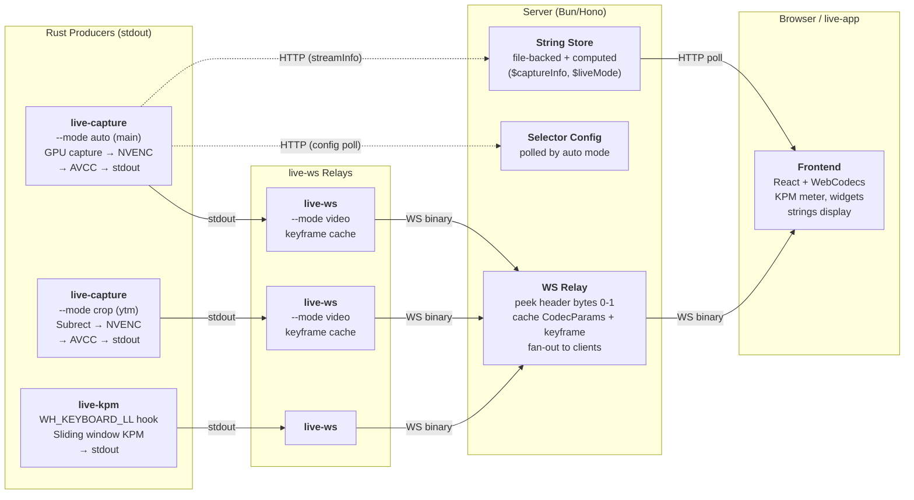

# Nekomaru LiveUI

**Nekomaru's livestreaming infrastructure.**

**Last Updated**: 2026-03-23

---

## Agent Rules

- **Always use `--release`** when invoking `cargo build` or `cargo run`. All binaries in this project are release-built by default.
- **Never hardcode `LIVE_PORT` or `LIVE_VITE_PORT`** values (e.g. `3000`, `5173`). When emitting Nushell scripts, use `$env.LIVE_PORT` and `$env.LIVE_VITE_PORT`.

---

## Milestones

This project is not semantically versioned. Instead, we track **milestones** (Mx) — architectural evolution points.

| Milestone | Architecture | Key Characteristics |
|-----------|-------------|---------------------|
| **M0** | Prototype | Auto-selector only — first proof of concept |
| **M1** | Monolith | Single Rust/wry process: capture + encoding + HTTP + webview |
| **M2** | Client-Server (TS) | TS server (Hono/Bun) + Rust capture children + React frontend + Rust webview host |
| **M3** | Client-Server (Rust) | Full RIIR — Rust server (Axum) replaces TS server |
| **M4** | Microservice | Stdout-first Rust capture workers → `live-ws` relay → TS server (Hono/Bun). **Current architecture.** |

**This document describes M4.** For the design journey from M3 to M4, see [`M4-DESIGN.md`](M4-DESIGN.md).

---

## Table of Contents

- [Quick Start](#quick-start)
- **[Architecture](#architecture)** — components, principles, file ownership
  - [Microservice Design](#microservice-design)
  - [Design Principles](#design-principles)
- **[Communication](#communication)** — wire protocol, HTTP/WS endpoints, CLI
  - [Wire Protocol (live-protocol)](#wire-protocol-live-protocol)
  - [HTTP & WebSocket API](#http--websocket-api)
- **[Internals](#internals)** — encoding pipeline, capture modes, deployment, reconnection
  - [Encoding Pipeline](#encoding-pipeline-reference)
  - [Capture Modes](#capture-modes)
  - [Distributed Deployment](#distributed-deployment)
  - [Reconnection Strategy](#reconnection-strategy)
  - [Widgets](#widgets)
- [Performance Metrics](#performance-metrics)
- [File Structure](#file-structure)
- [Lessons Learned](#lessons-learned)
- [Known Issues](#known-issues)

---

## Quick Start

```bash
# Install: build all Rust crates + frontend + server dependencies
just install

# Each service runs in its own terminal.
# All require LIVE_PORT and LIVE_VITE_PORT environment variables.

# 1. Start the TS relay server + Vite dev server
just server

# 2. Start the auto-selector capture pipeline (main stream)
just capture auto

# 3. Start the YouTube Music crop capture pipeline
just capture youtube-music

# 4. Start the keystroke counter pipeline
just kpm

# Open the frontend — the server is the entry point.
# http://localhost:$LIVE_PORT

# (Optional) Launch the webview host
just app

# (Optional) Launch YouTube Music in a webview
just youtube-music
```

Each capture pipeline is a Unix pipe: `live-capture ... | live-ws --mode video ...`. The Nushell orchestration scripts in `mod.nu` handle the full command lines.

---

## Architecture

### Microservice Design

M4 splits the system into independently runnable components connected via stdout pipes and WebSocket.  Producers (`live-capture`, `live-kpm`) write binary frames to stdout using the `live-protocol` framing format.  `live-ws` reads stdin and relays each message as a WS binary message to the server.  The server is a thin TS relay — no binary parsing, no process management, no circular buffering.



### Component Summary

| Component | Language | Role | I/O |
|-----------|----------|------|-----|
| **`live-protocol`** | Rust (lib) | Shared 8-byte frame header + AVCC helpers | Used by all Rust crates |
| **`live-capture`** | Rust | GPU capture + NVENC encode | stdout (live-protocol framed) |
| **`live-ws`** | Rust | stdin → WS relay | stdin → WS binary messages |
| **`live-kpm`** | Rust | Keystroke counter | stdout (live-protocol framed) |
| **`enumerate-windows`** | Rust | Window discovery (JSON) | stdout JSON |
| **Server** | TypeScript (Bun/Hono) | WS relay, string store, config | WS ↔ WS, HTTP |
| **Frontend** | React + Vite | Viewer UI | WS (video, kpm), HTTP (strings) |
| **`live-app`** | Rust (wry) | Optional webview host | — |

### Why This Design?

| Concern | Decision | Rationale |
|---------|----------|-----------|
| GPU capture + encoding | Rust (`live-capture`) | Requires `unsafe` Windows APIs, hardware access, zero-copy GPU pipelines. |
| Network transport | `live-ws` (separate binary) | Producers have one code path (stdout). No WS client, no reconnect logic in capture code. `live-ws` handles all networking. |
| Keystroke counting | Rust (`live-kpm`, standalone) | `WH_KEYBOARD_LL` hook on a dedicated message pump thread. Privacy-by-design. |
| HTTP/WS server | TypeScript (Bun/Hono) | Thin relay — no binary parsing, no process management. Fast iteration. |
| Window discovery | Rust (`enumerate-windows`) | Lightweight binary for Nushell scripts. JSON output. |
| Orchestration | Nushell (`mod.nu`) | Launches pipelines, discovers YTM windows, manages service lifecycle. |
| Frontend | React + WebCodecs | Pure viewer. Receives `live-protocol` framed messages via WS. Zero H.264 knowledge. |

### Well-Known Stream IDs

The system uses **fixed, well-known stream IDs** rather than dynamically generated ones.  Each pipeline is assigned its ID at launch (via `--stream-id` on `live-ws`), and the frontend hardcodes the same IDs.

| Stream ID | Producer | Purpose |
|-----------|----------|---------|
| `"main"` | `live-capture --mode auto` | Foreground window (auto-selector) |
| `"youtube-music"` | `live-capture --mode crop` | YouTube Music playback bar |

**Why fixed IDs?**  The frontend is a pure viewer — it has zero stream management logic.  It renders `"main"` unconditionally and shows `"youtube-music"` when available (polled via `GET /api/v1/streams`).  No discovery protocol, no negotiation, no dynamic allocation.  When the auto-selector hot-swaps the captured window, the stream ID stays `"main"` — the server sends fresh CodecParams and a keyframe, and the frontend reinitializes its decoder.

**Where IDs are assigned:**  Nushell orchestration (`mod.nu`) passes `--stream-id` to `live-ws`, which connects to `/api/v1/streams/ws/:id/input`.  The server creates the stream slot on first encoder connection.

### Design Principles

These principles guide M4 development and operation.

1. **No Internal Start/Stop State.**  If a process is running, it's active.  Kill it to stop it.  No state machines, no `Starting → Running → Stopped` transitions.

2. **Stateless Executables.**  Each component gets all configuration from CLI args and HTTP.  No stdin commands, no dynamic reconfiguration.  Exception: `--mode auto` polls config from the server (read-only HTTP).

3. **Stdout-First Producers.**  `live-capture` and `live-kpm` write to stdout via `live-protocol` framing.  Zero networking dependencies.  `> dump.bin` IS the production code path.

4. **Independently Runnable.**  Every component can run standalone.  No component assumes it was spawned by another.  Server runs with or without any workers connected.

5. **Pipes + WS Everywhere.**  Producers → stdout → `live-ws` → WS → server → WS → frontend.  Distributed deployment is a consequence, not a feature — just change the server URL.

6. **Server is a Relay, Not a Manager.**  The server doesn't spawn processes or manage lifecycles.  It receives connections and relays data.

7. **Errors Go to stderr.**  Each process logs to stderr via `pretty_env_logger`.  No error protocol between components.

8. **Fixed Resolutions.**  Each stream has a fixed output resolution.  The encoder never needs reconfiguration on window switch — the staging texture, NV12 converter, and MFT media types all stay the same.

### File Ownership

Each source file has a primary owner — **agent** (Claude) or **human** (Nekomaru). See [`FILE-OWNERSHIP.md`](../FILE-OWNERSHIP.md) for the full per-file breakdown.

---

## Communication

### Wire Protocol (live-protocol)

All binary IPC uses the `live-protocol` 8-byte aligned frame header.  Used on stdout (producer → live-ws), on WebSocket (live-ws → server → frontend), and in dump files.

#### Frame Header (8 bytes)

```
Offset  Field            Size    Notes
0       message_type     u8      0x01=CodecParams, 0x02=Frame, 0x10=KpmUpdate, 0xFF=Error
1       flags            u8      bit 0: IS_KEYFRAME (video), bits 1-7: reserved
2       reserved         u16     zero
4       payload_length   u32 LE
[payload_length bytes follow]
```

#### Message Types

##### `0x01` — CodecParams

Sent once after encoder initialization, and again if SPS/PPS change (e.g. on hot-swap).

```
[u16 LE: width][u16 LE: height]
[u16 LE: sps_length][sps bytes]
[u16 LE: pps_length][pps bytes]
```

##### `0x02` — Frame

Sent for every encoded frame. `is_keyframe` is in the header `flags` field, not in the payload.

```
[u64 LE: timestamp_us][avcc bytes]
```

The AVCC payload is pre-built by `live-capture` — concatenated length-prefixed NAL units (4-byte BE length + raw NAL data, no Annex B start codes). Directly feedable to `EncodedVideoChunk`.

##### `0x10` — KpmUpdate

Sent by `live-kpm` on value change.

```
[i64 LE: kpm_value]
```

##### `0xFF` — Error

Non-fatal error. Fatal errors are signaled by process exit.

```
[UTF-8 error message bytes]
```

### live-capture CLI

```bash
# Base mode — capture + encode to stdout
live-capture --hwnd 0x1A2B --width 1920 --height 1200

# Auto mode — foreground polling + hot-swap
live-capture --mode auto --width 1920 --height 1200 \
  --config-url http://host/api/v1/streams/auto/config \
  --event-url http://host/api/core/streamInfo/main

# Crop mode — fixed subrect extraction
live-capture --mode crop --hwnd 0x1A2B \
  --crop-min-x 0 --crop-min-y 600 --crop-max-x 1920 --crop-max-y 700 --fps 15

# Dump to file (production code path — same output format)
live-capture --hwnd 0x1A2B --width 1920 --height 1200 > dump.bin
```

### enumerate-windows CLI

```bash
# List all capturable windows as JSON
enumerate-windows

# Get the current foreground window as JSON
enumerate-windows --foreground
```

---

### HTTP & WebSocket API

Served by the TS server (Bun/Hono). Port configured via `LIVE_PORT` (required). All endpoints prefixed with `/api/v1`.

#### Video Relay (WebSocket)

**`WS /api/v1/streams/ws/:id/input`** — Encoder input. Receives `live-protocol` binary messages from `live-ws`. The server peeks at header bytes 0-1 to cache CodecParams and keyframes, then fan-outs to all connected frontend clients.

**`WS /api/v1/streams/ws/:id`** — Frontend viewer. Pushes relayed binary messages. On connect, sends cached CodecParams + last keyframe for immediate playback.

**`GET /api/v1/streams`** — List active streams (derived from connected encoder WS sockets).

```json
[{ "id": "main" }, { "id": "youtube-music" }]
```

**`GET /api/v1/streams/:id/init`** — Pre-built decoder configuration. The server parses cached CodecParams to build the `avc1.PPCCLL` codec string and avcC descriptor.

```json
{
    "codec": "avc1.42001f",
    "width": 1920,
    "height": 1200,
    "description": "<base64 of avcC descriptor>"
}
```

#### KPM Relay (WebSocket)

**`WS /api/v1/kpm/ws/input`** — KPM input from `live-kpm` via `live-ws`. Binary `live-protocol` messages.

**`WS /api/v1/kpm/ws`** — Frontend KPM display. Pushes `{"kpm": N}` or `{"kpm": null}` JSON text. Initial value sent on connect.

#### String Store

Server-managed key-value store. Keys prefixed with `$` are **computed strings** — readonly values set by worker events.

**Current computed strings:**

| Key | Source | Description |
|-----|--------|-------------|
| `$captureInfo` | `POST /api/core/streamInfo` | Human-readable label for the captured window |
| `$captureMode` | `POST /api/core/streamInfo` | Current capture mode (e.g. `"auto"`) |
| `$liveMode` | `POST /api/core/streamInfo` | Mode tag from matched pattern (e.g. `"code"`, `"game"`) |
| `$timestamp` | Server startup | Revision timestamp via `jj log` |

**`GET /api/v1/strings`** — All key-value pairs (file-backed + computed).

**`PUT /api/v1/strings/:key`** — Set a string value. Returns 403 for `$`-prefixed keys.

**`DELETE /api/v1/strings/:key`** — Delete a string. Returns 403 for `$`-prefixed keys.

#### Selector Config

The server stores the selector config; `live-capture --mode auto` polls it.

**`GET /api/v1/streams/auto/config`** — Full preset config (polled by auto mode every ~20s).

**`PUT /api/v1/streams/auto/config`** — Replace full config.

**`PUT /api/v1/streams/auto/config/preset`** — Switch active preset by name (text/plain body).

#### Worker Events

**`POST /api/core/streamInfo/:streamId`** — Capture switch metadata from `live-capture --mode auto`. Updates computed strings.

```json
{
    "hwnd": "0x1A2B",
    "title": "Visual Studio Code",
    "file_description": "Visual Studio Code",
    "mode": "code"
}
```

#### Refresh

**`POST /api/v1/refresh`** — Reload selector config and string store from disk.

---

## Internals

### Encoding Pipeline Reference

#### Format Converter (`live-capture/src/converter.rs`)

GPU-accelerated BGRA→NV12 conversion via `ID3D11VideoProcessor`. Hardware H.264 encoders require NV12 input. Performance: ~0.5-1ms for 1920x1200.

#### H.264 Encoder (`live-capture/src/encoder.rs`)

Async Media Foundation Transform (MFT). Runs a blocking event loop:

- `METransformNeedInput` → read from staging texture, convert, feed to encoder
- `METransformHaveOutput` → parse NAL units, convert to AVCC, write to stdout

NAL unit types: SPS(7) ~27B, PPS(8) ~8B, IDR(5) ~67KB, NonIDR(1) ~1.5-30KB.

#### "Bakery Model" (Capture Thread ↔ Encoding Thread)

Within `live-capture`, the capture thread (main) and encoding thread share a staging texture ("the shelf"). The capture thread continuously restocks it with the latest captured frame; the encoding thread reads at a constant 60fps. No channels, no CPU copies — just a shared GPU texture with `Flush()` synchronization.

In **auto mode**, the capture session can be hot-swapped without restarting the encoder. The staging texture dimensions are fixed (set at startup), so the encoder's input format never changes. On window switch, only the `CaptureSession` is replaced.


### Capture Modes

`live-capture` supports three modes via `--mode`:

- **`base`** (default): captures a specific window by HWND, resamples to `--width x --height`.
- **`auto`**: foreground polling + pattern matching + hot-swap capture session. The encoder never restarts — only the `CaptureSession` is replaced on window switch.
- **`crop`**: extracts an absolute subrect via `--crop-min-x/y --crop-max-x/y`. Used for YouTube Music playback bar.

All modes output to stdout via `live-protocol` framing. Pipe through `live-ws` for network delivery.

### Selector Pattern Format

The auto-selector matches foreground windows against patterns from the server config. Format: `[@mode] <exePath>[@<windowTitle>]`.

- `@code devenv.exe` — match devenv, set mode="code"
- `@game D:/7-Games/` — match any exe under path, set mode="game"
- `@exclude gogh.exe` — veto rule (checked first, case-insensitive)
- `Code.exe@LiveUI` — match Code.exe with "liveui" in title (AND)

### Distributed Deployment

M4's microservice design enables splitting components across machines.  Each producer is a stdout-first executable piped through `live-ws` — just point `live-ws` at a remote server URL.

```
Machine A (streaming):  server + live-capture --mode crop (ytm) + YouTube Music + OBS + live-app
Machine B (working):    live-capture --mode auto (main) + live-kpm
```

- YouTube Music audio: OBS captures system audio directly on Machine A.  Zero network audio transfer.
- Only the main video stream crosses the LAN (~1.8 MB/s at 60fps, trivial on gigabit).
- Machine B runs only what needs direct window/GPU access.
- Face capture (OBS camera) stays on Machine A — no CPU competition with `rustc`.

### Reconnection Strategy

`live-ws` owns all reconnection logic — producers don't know about WS state.

- The encoder writes to stdout continuously.  If `live-ws` disconnects, it discards incoming messages.
- On reconnect, `live-ws --mode video` replays the cached last CodecParams + last keyframe so the server immediately has valid codec state and a clean entry point.
- Exponential backoff (100ms → 5s) prevents reconnection storms.
- The encoder never restarts — avoiding the NVENC teardown that M4 was designed to eliminate.

### Widgets

The left column of the UI hosts **widgets** — small status indicators built from a shared `LiveWidget` component (`frontend/src/widgets/common.tsx`).

#### Layout

Each widget has a consistent three-part structure:

```
┌─────────────────────┐
│  [icon]  Label      │   ← icon (optional) + muted label (text-xs, 60% opacity)
│          Content    │   ← prominent value (text-base, full opacity)
└─────────────────────┘
```

#### Dynamic Content

`LiveWidget` is purely presentational. For dynamic values, the parent component calls `useStrings()` to poll the server-managed string store and passes values as `children`.

#### Placement

Widgets are rendered inside `SidePanel` (the left column island in `app.tsx`), which uses `flex-col gap-3` layout.

---

## Performance Metrics

### Latency Breakdown (Estimated)

| Component | Time | Method |
|-----------|------|--------|
| Capture | 0-16ms | Windows Graphics Capture (1 frame buffer) |
| Resample | 0.5-1ms | GPU shader (fullscreen triangle) |
| GPU Flush + Wait | 5ms | `Flush()` + `sleep(5ms)` |
| BGRA→NV12 | 0.5-1ms | `ID3D11VideoProcessor` |
| GPU Flush | 1-2ms | `Flush()` |
| H.264 Encode | 5-15ms | NVENC hardware encoder |
| AVCC Serialize | <0.1ms | CPU: strip start codes + length prefix |
| IPC (stdout → live-ws) | <0.1ms | Pipe buffer, same machine |
| WS relay (server) | <1ms | Localhost or LAN |
| **Total** | **13-36ms** | Well under 100ms target |

### Frame Sizes (1920x1200 @ 8 Mbps CBR)

| Frame Type | Size Range | Scenario |
|------------|------------|----------|
| **IDR (keyframe)** | ~67 KB | SPS(27B) + PPS(8B) + full I-frame |
| **P-frame (static)** | 1.5-10 KB | Mostly unchanged screen content |
| **P-frame (typing/scrolling)** | 10-30 KB | Text editing, web browsing |
| **P-frame (high motion)** | 30-50 KB | Video playback, animations |

### Encoding Settings

| Setting | Value | Reason |
|---------|-------|--------|
| Profile | H.264 Baseline | No B-frames, WebCodecs compatibility |
| Bitrate | 8 Mbps CBR | Constant for predictable latency |
| Frame Rate | 60 fps | Encoder runs at constant 60fps |
| GOP Size | 120 frames (2 sec) | Fast recovery from packet loss |
| B-frames | 0 | Baseline profile prohibits (low latency) |
| Low Latency Mode | Enabled | `CODECAPI_AVLowLatencyMode = true` |

---

## File Structure

```
LiveUI/
├── Cargo.toml                       # Workspace root
├── .justfile                        # Task runner recipes (just)
├── mod.nu                           # Nushell orchestration module
│
├── docs/
│   ├── README.md                    # This document
│   └── M4-DESIGN.md                # M4 architecture design & journey
│
├── data/                            # Persisted runtime data (gitignored)
│   ├── strings.json                 # String store key-value pairs
│   ├── strings/                     # Per-key Markdown files for multiline values
│   └── selector-config.json         # Auto-selector preset config
│
├── live-protocol/                   # Shared binary framing protocol (Rust lib)
│   └── src/
│       ├── lib.rs                   # 8-byte frame header, MessageType, Flags, read/write
│       ├── avcc.rs                  # Annex B → AVCC conversion, codec string, avcC builder
│       └── video.rs                 # CodecParams + Frame payload serialization
│
├── live-capture/                    # GPU capture + H.264 encode → stdout (Rust)
│   └── src/
│       ├── lib.rs                   # NALUnit/NALUnitType types, module re-exports
│       ├── main.rs                  # CLI: --mode base|auto|crop, capture loop, encoding thread
│       ├── capture.rs               # WinRT CaptureSession, CropBox, viewport calculation
│       ├── converter.rs             # GPU BGRA→NV12 via ID3D11VideoProcessor
│       ├── d3d11.rs                 # D3D11 device, texture, RTV/SRV helpers
│       ├── encoder.rs               # NVENC H.264 async MFT
│       ├── encoder/                 # NVENC helpers (debug, finder)
│       ├── resample.rs + .hlsl      # GPU fullscreen quad resampler
│       └── selector/                # Auto-selector (foreground polling, pattern matching)
│           ├── mod.rs               # Selector thread, swap commands, HTTP client
│           └── config.rs            # PresetConfig, ParsedPattern, should_capture()
│
├── live-ws/                         # stdin → WebSocket relay (Rust)
│   └── src/main.rs                  # CLI, stdin reader, WS client, --mode video caching
│
├── live-kpm/                        # Standalone keystroke counter (Rust)
│   └── src/
│       ├── main.rs                  # Entry point, timer loop, stdout output
│       ├── hook.rs                  # WH_KEYBOARD_LL hook, atomic counter, auto-repeat suppression
│       ├── calculator.rs            # Sliding window KPM calculator (5s window)
│       └── message_pump.rs          # Reusable Win32 message pump (dedicated OS thread)
│
├── server/                          # TS relay server (Bun/Hono)
│   ├── package.json
│   └── src/
│       ├── index.ts                 # Entry point, route mounting, Vite child, shutdown
│       ├── log.ts                   # Colored structured logging (markers, alignment, levels)
│       ├── protocol.ts              # Hand-written constants matching live-protocol
│       ├── video.ts                 # WS relay (encoder input → frontend), codec caching
│       ├── codec.ts                 # build_codec_string, build_avcc_descriptor in TS
│       ├── kpm.ts                   # KPM WS relay (binary input → JSON frontend push)
│       ├── strings.ts               # String store (file-backed + computed)
│       ├── selector.ts              # Selector config storage + routes
│       ├── core.ts                  # Worker event endpoints (streamInfo)
│       └── persist.ts               # JSON file I/O helpers
│
├── live-app/                        # Optional webview host (wry)
│   └── src/main.rs
│
├── crates/
│   ├── enumerate-windows/           # Window enumeration (lib + bin, JSON output)
│   ├── set-dpi-awareness/           # Per-monitor DPI awareness v2
│   └── job-object/                  # Win32 job object for child process cleanup
│
├── frontend/                        # Frontend (React 19 + Vite + Tailwind)
│   ├── package.json
│   ├── vite.config.ts
│   ├── index.html
│   ├── index.tsx                    # Entry point (React 19 createRoot)
│   └── src/
│       ├── ws.ts                    # Low-level WebSocket helpers
│       ├── api.ts                   # fetch() wrapper for /api/v1/streams
│       ├── app.tsx                  # Pure viewer shell (JetBrains Islands dark theme)
│       ├── streams.ts               # useStreamStatus() hook (polls stream availability)
│       ├── strings-api.ts           # fetch() wrapper for /api/v1/strings
│       ├── strings.ts               # useStrings() hook (polls string store)
│       ├── kpm.tsx                  # useKpm() hook (WS push) + <KpmMeter> VU bar
│       ├── widgets/                 # SidePanel widgets (Clock, Mode, Capture, About)
│       └── video/                   # Video stream module
│           ├── index.tsx            # <StreamRenderer> (WS push, live-protocol parser)
│           ├── decoder.ts           # H264Decoder (thin WebCodecs wrapper)
│           └── chroma-key.ts        # WebGL2 chroma-key renderer
│
├── live-video/                      # [M3 artifact, pending removal]
└── live-server/                     # [M3 artifact, pending removal]
```

---

## Lessons Learned

### Bug #1: Codec API Settings Order

**Problem**: `ICodecAPI::SetValue()` before media types → "parameter is incorrect"

**Fix**: Set media types first, then codec API values. Correct order:
1. Output media type (H.264, resolution, frame rate, bitrate, profile)
2. Input media type (NV12, resolution, frame rate)
3. D3D manager (attach GPU device)
4. Codec API values (B-frames, GOP, latency mode, rate control)
5. Start streaming

### Bug #2: Missing Viewport → Empty Frames

**Problem**: All P-frames were 12 bytes (black frames). Resampler didn't set viewport → GPU clipped fullscreen triangle → empty output.

**Fix**: Always set `RSSetViewports()` before draw calls.

---

## Known Issues

### 1. Hardcoded NVIDIA Encoder

Only selects encoders with "nvidia" in name. Fails on Intel/AMD.
**Priority**: Low (personal use, RTX 5090).

---

## References

### Windows API
- [Media Foundation Transforms](https://learn.microsoft.com/en-us/windows/win32/medfound/media-foundation-transforms)
- [H.264 Video Encoder](https://learn.microsoft.com/en-us/windows/win32/medfound/h-264-video-encoder)
- [ID3D11VideoProcessor](https://learn.microsoft.com/en-us/windows/win32/api/d3d11/nn-d3d11-id3d11videoprocessor)
- [Async MFTs](https://learn.microsoft.com/en-us/windows/win32/medfound/asynchronous-mfts)

### Web Standards
- [WebCodecs API](https://w3c.github.io/webcodecs/)
- [H.264 Specification](https://www.itu.int/rec/T-REC-H.264)
- [ISO 14496-15 (AVC File Format)](https://www.iso.org/standard/55980.html)

---

**Author**: Nekomaru
**Co-Pilot**: Claude
**Hardware**: NVIDIA GeForce RTX 5090
**License**: Personal Use Only
